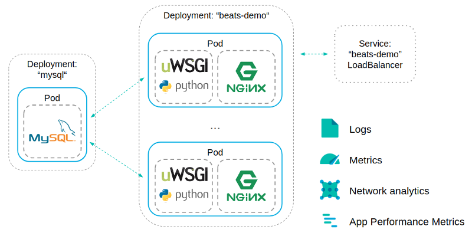
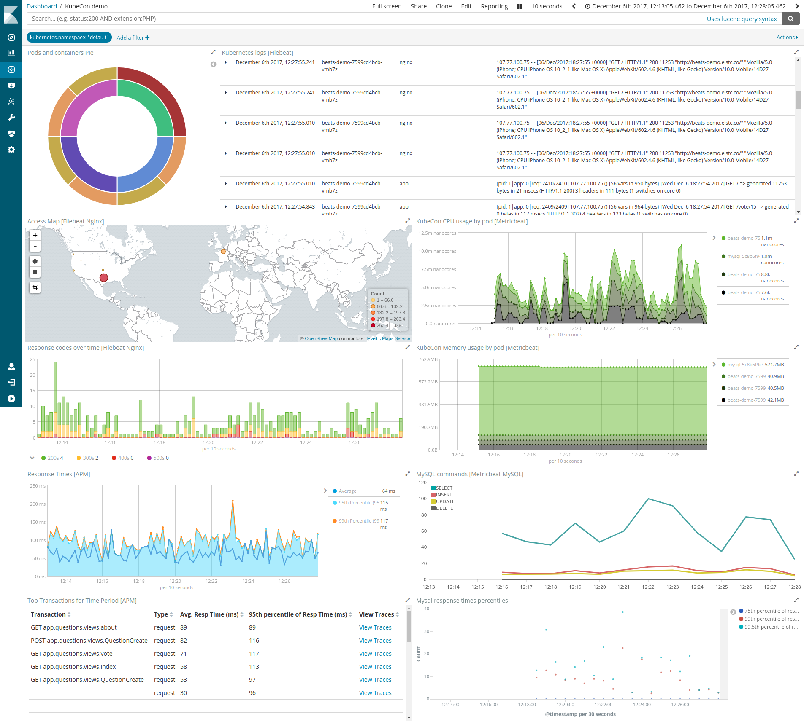

Beats Kubernetes demo
=====================

About Beats
-----------

The <a href="https://www.elastic.co/products/beats">Beats</a> are lightweight data shippers,
written in Go, that you install on your servers to capture all sorts of operational data
(think of logs, metrics, or network packet data). The Beats send the operational data to
Elasticsearch, either directly or via Logstash, so it can be visualized with Kibana.

Demo scenario
-------------

This demo runs on Kubernetes, it's composed of a simple Django app, served by uWSGI and with
a Nginx frontend. It uses MySQL as data backend.

Everything is monitored using Beats and <a href="https://www.elastic.co/guide/en/apm/get-started/master/index.html">Elastic APM</a>.

 * <a href="https://www.elastic.co/guide/en/beats/filebeat/6.0/running-on-kubernetes.html">Filebeat</a> ships logs from all running containers, enriched with Kubernetes metadata
 * <a href="https://www.elastic.co/guide/en/beats/metricbeat/6.0/running-on-kubernetes.html">Metricbeat</a> ships system metrics for all nodes in the cluster and Kubernetes metrics on containers resource consumption and state
 * <a href="https://www.elastic.co/guide/en/beats/packetbeat/6.0/index.html">Packetbeat</a> monitors the network and applications by sniffing packets
 * <a href="https://www.elastic.co/guide/en/apm/get-started/master/index.html">Elastic APM</a> gather tracing timing data from your applications

 Example dashboard
 -----------------

